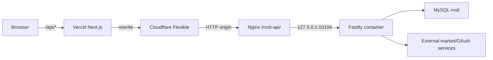

# NXDI 서버/클라이언트 분리 구현 명세

## 1. 목표

현재 Next.js/Vercel 서버리스 애플리케이션에서 DB 접근, 인증, 외부 시장 데이터 연동,
스케줄 작업을 경량 상시 실행 백엔드로 분리한다.

- 저장소 루트에 `client/`와 `server/`를 둔다.
- 클라이언트는 Next.js를 유지하고 Vercel에 배포한다.
- 서버는 Node.js 24, TypeScript, Fastify, Prisma, Zod로 구성한다.
- 서버는 `59.28.34.117`의 Apple Silicon Mac mini에 Docker Compose로 배포한다.
- 브라우저의 기존 `/api/*` 호출은 Vercel rewrite를 통해 Fastify로 전달한다.
- 외부 동기화 스케줄은 GitHub Actions/Vercel Cron에서 Fastify 프로세스로 이동한다.
- 기존 MySQL `nxdi` 스키마와 데이터를 그대로 사용하되 물리 테이블명을 정리한다.
- 서버 분리 완료 후 핵심 비즈니스 서비스 테스트만 BDD 시나리오 중심으로 재편한다.

## 2. 비목표

- 별도 저장소 생성
- Kubernetes, 별도 worker, 메시지 큐 도입
- Flyway/Liquibase/Prisma Migrate 이력 체계 도입
- Cucumber 도입
- 모든 API의 일괄적인 응답 포맷 재설계
- Cloudflare Flexible을 Full/Strict로 전환
- MySQL 전용 애플리케이션 계정 생성
- 기존 MySQL/Redis의 공개 포트 구조 변경

## 3. 감사 결과

### 3.1 현재 애플리케이션

- Next.js API route 파일 24개, HTTP 핸들러 26개
- Prisma 모델/물리 테이블 9개
- DB 접근 모듈: `store`, `portfolio-store`, `dividends`, `disclosures`, `roadmap`
- 외부 서비스: DataGSM, open.er-api.com, KRX OpenAPI, OpenDART, FMP, Yahoo Finance
- 현재 unit test: 40 suites, 92 tests, 전부 통과
- 현재 테스트는 순수 계산/표시 유틸에 편중되어 있고 서비스 I/O 경계는 거의 검증하지 않음

### 3.2 주요 문제

- 공개 페이지 조회 중 배당 외부 동기화와 DB 쓰기가 발생한다.
- 홈 화면에서 동일 배당 동기화가 중복 실행될 수 있다.
- OpenDART 배당 조회는 종목당 최대 16개 요청을 제한 없이 병렬 실행한다.
- 일부 Yahoo/FMP/OpenDART/DataGSM/환율 호출에 timeout과 retry 정책이 없다.
- 거래와 출금 요청은 read-modify-write가 트랜잭션으로 보호되지 않는다.
- 의향서 화면은 전체 사용자의 연락처/계좌를 읽은 뒤 애플리케이션에서 필터링한다.
- 스케줄 작업에 중복 실행 잠금이 없다.
- GitHub hourly schedule은 실제로 1~4시간 간격으로 불규칙하게 실행된다.

### 3.3 원격 서버

- macOS 26.4.1, arm64, RAM 16GB
- Docker Engine 29.4.1, Docker Compose 5.1.3
- Docker VM 메모리 한도 약 7.75GiB
- Homebrew Nginx 1.29.8, HTTP 80만 사용
- Cloudflare Flexible을 사용하는 `kimtaeeun.site`가 기존 Nginx 가상 호스트
- MySQL 8.0.46 컨테이너: host port 3306, `nxdi` 스키마 존재
- Redis 7 컨테이너: host port 6379
- 신규 서버 host port는 `127.0.0.1:10104`를 사용한다.

## 4. 확정된 의사결정

| 항목 | 결정 |
|---|---|
| 백엔드 | Node.js 24 + TypeScript + Fastify + Prisma + Zod |
| DB 계정 | 기존 MySQL 전역 root 계정 사용 |
| Redis | 필수 아님. 실제 필요가 생길 때만 사용 |
| 공개 브라우저 API | 기존 `/api/*` 유지 |
| Vercel 연결 | `/api/*`를 원격 Fastify로 same-origin rewrite |
| 원격 API origin | `https://kimtaeeun.site/nxdi-api/` |
| 컨테이너 bind | `127.0.0.1:10104:3000` |
| 스케줄 | Fastify 컨테이너 내부에서 실행 |
| 동시 실행 방지 | MySQL named lock. 잠금용 전용 connection 사용 |
| 배포 액션 | `8G4B/GSM-SV-Deploy` v1.2.1의 정확한 commit SHA 사용 |
| 서버 환경변수 | GitHub Actions secret 하나에 `.env` 전문 저장 |
| DB 이름 규칙 | `tb_` + 복수 snake_case |
| 스키마 변경 | 일회성 SQL, 마이그레이션 이력 프레임워크 없음 |
| 다운타임 | 테이블 rename/전환 중 짧은 다운타임 허용 |
| 테스트 | `node:test` 유지, 핵심 서비스 BDD 시나리오로 재편 |

## 5. 목표 디렉터리 구조

```text
.
├── client/
│   ├── package.json
│   ├── package-lock.json
│   ├── next.config.ts
│   ├── vercel.json
│   ├── public/
│   ├── content/
│   └── src/
├── server/
│   ├── package.json
│   ├── package-lock.json
│   ├── tsconfig.json
│   ├── prisma/
│   │   └── schema.prisma
│   ├── src/
│   │   ├── app.ts
│   │   ├── index.ts
│   │   ├── application/
│   │   ├── domain/
│   │   ├── infrastructure/
│   │   ├── routes/
│   │   └── scheduler/
│   ├── test/
│   └── deploy/
│       ├── Dockerfile
│       ├── compose.yml
│       ├── deployspec.yml
│       └── scripts/
├── .github/workflows/
├── docs/
└── README.md
```

클라이언트와 서버는 각자 lockfile을 가진 독립 npm 패키지로 둔다. 루트 workspace나 세 번째
shared 패키지는 만들지 않는다. API DTO 중복은 초기 분리 단계에서 허용하며 OpenAPI 생성은
후속 최적화로 남긴다.

## 6. 요청 흐름



- Nginx는 `/nxdi-api/` prefix를 제거하고 Fastify에 전달한다.
- Fastify는 `trustProxy`를 활성화하고 공개 URL은 요청 헤더가 아니라 `PUBLIC_APP_URL`로 계산한다.
- 컨테이너 포트는 loopback에만 bind한다.
- Next server component의 공개 데이터 조회는 API origin을 직접 호출할 수 있다.
- 인증된 server component 요청은 사용자 Cookie를 Fastify 요청에 명시적으로 전달한다.

## 7. API 전략

### 7.1 호환성 원칙

- 기존 mutation/auth 경로와 303 redirect/flash 동작을 우선 보존한다.
- 기존 브라우저 컴포넌트의 `/api/market/*`, `/api/admin/*` 호출 경로를 유지한다.
- 새 read API만 명시적으로 추가한다.
- 첫 분리에서 모든 응답을 공통 envelope로 강제하지 않는다.
- Zod schema로 path/query/body를 검증하고 Fastify 공통 error handler로 오류를 정규화한다.

### 7.2 신규 read API

| Method | Path | 목적 |
|---|---|---|
| GET | `/api/public/home` | 홈 포트폴리오, 배당, 스냅샷, 공시 집계 |
| GET | `/api/disclosures` | 공시 목록 및 페이지네이션 |
| GET | `/api/disclosures/:id` | 공시 상세 |
| GET | `/api/stocks/:symbol` | 종목 상세와 캐시된 차트/배당 정보 |
| GET | `/api/metrics/:metric` | 지표 화면 데이터 |
| GET | `/api/simulation` | 투자금액별 시뮬레이션 |
| GET | `/api/intents/me` | 세션 사용자의 의향서만 DB 조건으로 조회 |
| GET | `/api/admin/dashboard` | 관리자 화면 초기 집계 |
| GET | `/health` | 컨테이너/Nginx 배포 검증 |

### 7.3 기존 경로 이관

- `/api/auth/datagsm/start`, `/callback`, `/logout`, `/dev-login`
- `/api/intents/invest`, `/withdraw`
- `/api/market/search`, `/quote`
- `/api/admin/status`
- `/api/admin/portfolio/*`
- `/api/admin/dividends/*`
- `/api/admin/disclosures/*`
- `/api/admin/roadmap-events/*`
- 기존 cron 경로는 수동 운영/진단용으로 남기되 내부 스케줄러가 기본 실행 주체가 된다.

## 8. 애플리케이션 계층

### 8.1 Domain/Application

- `RequestInvestmentService`
- `RequestWithdrawalService`
- `ApplyHoldingTradeService`
- `DividendAllocationPolicy`
- `DividendForecastService`
- `RefreshPortfolioService`
- `SyncDividendRecordsService`
- `PortfolioSnapshotService`
- `DisclosureService`
- `RoadmapService`

순수 계산은 domain에 두고 Prisma, Fastify, fetch를 import하지 않는다. application service는
repository/gateway/clock/lock interface만 의존한다.

### 8.2 Infrastructure

- Prisma repository
- DataGSM OAuth gateway
- 환율 gateway
- KRX/OpenDART/FMP/Yahoo market-data gateway
- timeout/retry/concurrency helper
- MySQL named-lock adapter
- 메모리 TTL cache

Redis는 최초 구현의 필수 의존성으로 넣지 않는다. 단일 컨테이너와 MySQL named lock으로 충분하지
않은 상황이 확인될 때 `nxdi:` prefix를 사용해 추가한다.

## 9. 외부 동기화와 스케줄

### 9.1 스케줄

| 작업 | KST 일정 | 현재 대체 대상 |
|---|---|---|
| 포트폴리오 가격/스냅샷 refresh | 매시 05분 | GitHub `Portfolio Refresh` |
| 전일 snapshot finalize | 매일 00:10 | Vercel Cron 15:10 UTC |

- timezone을 `Asia/Seoul`로 명시한다.
- 애플리케이션 시작 시 당일 작업 상태를 확인하고 필요한 작업만 보정 실행한다.
- `GET_LOCK('nxdi:job:<name>', 0)`을 전용 MySQL connection에서 획득한다.
- lock 획득 실패는 정상 skip으로 기록한다.
- 모든 외부 호출에 AbortSignal timeout을 둔다.
- 429/5xx/network failure만 제한된 exponential backoff 대상으로 한다.
- 종목 단위 병렬성은 작은 고정값으로 제한한다.
- 공개 read API는 배당 DB 동기화를 암묵적으로 수행하지 않는다.

### 9.2 캐시

- KRX 검색 목록: 1시간 메모리 TTL
- OpenDART corp code: 장기 메모리 TTL
- Yahoo chart: symbol/range/interval 기준 TTL
- 환율: 마지막 성공 값을 프로세스 메모리에 유지하고 실패 시 사용
- 컨테이너 재시작 후 캐시 miss는 허용한다.

## 10. DB 정리

### 10.1 테이블 rename

| 기존 | 신규 |
|---|---|
| `PortfolioHolding` | `tb_portfolio_holdings` |
| `PortfolioDailySnapshot` | `tb_portfolio_daily_snapshots` |
| `DividendRecord` | `tb_dividend_records` |
| `monthly_dividend_records` | `tb_monthly_dividend_records` |
| `Disclosure` | `tb_disclosures` |
| `DisclosureTrade` | `tb_disclosure_trades` |
| `roadmap_events` | `tb_roadmap_events` |
| `InvestmentIntent` | `tb_investment_intents` |
| `WithdrawalIntent` | `tb_withdrawal_intents` |

- Prisma model 이름은 유지하고 모든 모델에 `@@map`을 명시한다.
- 이번 범위에서는 물리 컬럼명은 변경하지 않는다.
- 코드 참조 기준으로 9개 테이블 모두 활성 기능에 사용되므로 삭제 대상은 없다.
- 빈 intent/monthly 테이블도 활성 route와 관리자 기능 때문에 유지한다.

### 10.2 적용 절차

1. 백엔드 컨테이너 중지
2. `mysqldump`로 `nxdi` schema/data 백업, 파일 mode 0600
3. 하나의 다중 `RENAME TABLE` statement 실행
4. 새 Prisma `@@map`을 사용하는 컨테이너 기동
5. 테이블 목록, 각 행 수, FK, unique index 검증
6. `/health`와 핵심 read API smoke test

rename SQL은 old/new table 존재 여부를 점검하는 일회성 배포 스크립트로 둔다. Prisma Migrate
history는 생성하지 않는다.

### 10.3 정합성 보완

- holding 거래: transaction + row lock 또는 동등한 직렬화
- 출금 요청: 사용자 단위 lock 안에서 한도 재계산과 insert 수행
- 일반 사용자 intent 조회: `WHERE userId = session.user.id`를 repository에서 강제
- snapshot finalize: 이미 마감된 행은 다시 `closedAt`을 바꾸지 않도록 멱등 처리
- 수동 배당 레코드는 외부 동기화에서 덮어쓰지 않는 명시적 판정 로직 사용

## 11. 인증

- 기존 DataGSM PKCE 흐름을 Fastify로 이관한다.
- callback URL은 `https://nxdi.vercel.app/api/auth/datagsm/callback`을 유지한다.
- 기존 HMAC session payload와 `APP_SESSION_SECRET`을 재사용한다.
- session cookie: HttpOnly, Secure, SameSite=Lax, Path=/
- 관리자 판단은 `ADMIN_EMAILS` allowlist를 유지한다.
- browser API는 same-origin이므로 CORS는 기본적으로 열지 않는다.
- 공개 market endpoint에는 rate limit을 적용한다.

## 12. Docker/Nginx

### 12.1 Docker

- multi-stage `node:24-alpine` 이미지
- production dependency만 final image에 포함
- non-root Node user로 실행
- `init: true`, `restart: unless-stopped`
- healthcheck: `GET /health`
- host mapping: `127.0.0.1:10104:3000`
- `host.docker.internal:host-gateway` 추가
- `DATABASE_URL`은 host의 MySQL 3306을 가리킨다.

### 12.2 Nginx

기존 `/opt/homebrew/etc/nginx/servers/kimtaeeun.conf`에 idempotent marker block을 추가한다.

```nginx
location /nxdi-api/ {
    proxy_pass http://127.0.0.1:10104/;
    proxy_http_version 1.1;
    proxy_set_header Host $host;
    proxy_set_header X-Real-IP $remote_addr;
    proxy_set_header X-Forwarded-For $proxy_add_x_forwarded_for;
    proxy_set_header X-Forwarded-Proto $http_x_forwarded_proto;
}
```

- 적용 전 timestamp backup
- `nginx -t` 실패 시 자동 복구
- 성공 시 `nginx -s reload`

### 12.3 부팅 복구

- NXDI compose는 `restart: unless-stopped`를 사용한다.
- 기존 `site.kimtaeeun.docker-startup` LaunchAgent는 마지막 exit code 126이며 현 스크립트가 실제
  부팅 검증되지 않았다.
- 구현 후 기존 script의 stale container 이름을 정리하고 NXDI를 포함해 수동 kickstart로 검증한다.
- Docker Desktop 자체가 준비된 뒤 실행되는 대기 로직은 유지한다.

## 13. GitHub Actions CD

### 13.1 trigger

```yaml
on:
  push:
    branches: [main]
    paths:
      - "server/**"
      - ".github/workflows/server-deploy.yml"
```

- `concurrency`로 동시에 하나만 배포
- `permissions: contents: read`
- job `timeout-minutes` 지정
- 서버 lint/typecheck/unit test/build 성공 후 배포

### 13.2 action

사용자 결정에 따라 다음 v1.2.1 SHA를 그대로 사용한다.

```yaml
uses: 8G4B/GSM-SV-Deploy@f1639b120bc52e6535bc7e80fefafd282a4290cb
```

- target path는 `/Users/snowykte0426/deploy/nxdi`로 하드코딩한다.
- 비밀번호 인증은 repository secret으로 전달한다.
- `.env` 전문은 `SERVER_ENV` secret에서 runner의 임시 `runtime.env`로 mode 0600 생성한다.
- action이 `.env`를 제외하므로 `runtime.env`를 전송한 후 remote hook이 `.env`로 설치하고 삭제한다.
- remote `.env` mode는 반드시 0600으로 검증한다.

### 13.3 secrets

- `SERVER_HOST`
- `SERVER_USER`
- `SSH_PASSWORD`
- `SERVER_ENV`

`SERVER_ENV`는 Vercel production env를 기반으로 만들고 다음 서버 전용 값을 포함한다.

- `NODE_ENV=production`
- `HOST=0.0.0.0`
- `PORT=3000`
- `TZ=Asia/Seoul`
- `PUBLIC_APP_URL=https://nxdi.vercel.app`
- `DATABASE_URL`의 host는 `host.docker.internal:3306`

## 14. Vercel

- 기존 project `nxdi`의 Root Directory를 `client`로 변경한다.
- Node.js 24를 유지한다.
- `client/vercel.json`에서 cron을 제거한다.
- `/api/:path*`를 `https://kimtaeeun.site/nxdi-api/api/:path*`로 rewrite한다.
- client 경로가 바뀌지 않은 commit은 build를 skip하도록 Root Directory change detection 또는
  ignored build command를 설정한다.
- 서버 cutover 검증 후 Vercel에서 DB/API/OAuth 서버 secret을 제거한다.
- production alias `nxdi.vercel.app`은 유지한다.

## 15. 테스트 개편

### 15.1 원칙

- `node:test`, `describe/it`, `node:assert/strict` 유지
- Cucumber/Vitest/Jest 미도입
- 단순 formatter, label, presentation snapshot 테스트는 서버 unit suite에서 제거
- Prisma client module mocking 대신 repository/gateway interface의 in-memory fake 사용
- 외부 네트워크를 unit test에서 호출하지 않음
- 커버리지 총량보다 핵심 불변식과 시나리오 목록을 acceptance 기준으로 사용

### 15.2 BDD 우선순위

1. `RequestWithdrawalService`
2. `ApplyHoldingTradeService`
3. `DividendAllocationPolicy` / `DividendForecastService`
4. `SyncDividendRecordsService` / `RefreshPortfolioService`
5. `PortfolioSnapshotService`
6. `RequestInvestmentService` / `DataGsmEligibilityPolicy` / `RoadmapPolicy`

각 테스트는 Given-When-Then을 suite 이름에 드러낸다.

```ts
describe("RequestWithdrawalService", () => {
  describe("given accepted principal and a pending withdrawal", () => {
    describe("when the requested amount exceeds the available limit", () => {
      it("then rejects without saving an intent", async () => {});
    });
  });
});
```

### 15.3 최소 route smoke test

Fastify `app.inject()`으로 다음만 검증한다.

- 인증 없는 관리자 요청 거부
- Zod validation 실패 응답
- `/health`
- 사용자 intent API가 세션 사용자 범위만 반환

## 16. 구현 단계

### Phase A: 저장소 구조와 서버 골격

1. 기존 Next 앱을 `client/`로 이동
2. server package, Fastify app, env validation, health route 구성
3. Prisma schema 복사 및 repository 골격 구성
4. 독립 client/server CI 구성

### Phase B: 도메인/외부 연동/API 이관

1. 순수 계산 모듈을 server domain으로 이동
2. Prisma repository와 application service 작성
3. 외부 gateway에 timeout/concurrency/cache 적용
4. 인증, mutation route, 신규 read API 구현
5. client server component를 HTTP API 소비 방식으로 변경
6. 기존 Next API route 제거

### Phase C: 스케줄/Docker/CD

1. 내부 scheduler와 MySQL lock 구현
2. Dockerfile/compose/deploy hooks/Nginx apply 작성
3. GitHub secrets와 `server-deploy.yml` 구성
4. 원격 `/health` 검증

### Phase D: 서비스 전환

1. 기존 테이블명 상태로 새 backend/client 경로 먼저 검증
2. Vercel Root Directory 및 rewrite 전환
3. GitHub/Vercel 기존 scheduler 비활성화
4. 짧은 점검 중단 시작
5. DB 백업, table rename, 새 Prisma mapping 서버 배포
6. 행 수/FK/API/로그 검증
7. 점검 종료

### Phase E: BDD 테스트 재편과 정리

1. service interface/fake 기반 핵심 BDD suite 작성
2. 표시/포맷 위주 테스트 제거 또는 client 범위로 한정
3. Node 24 기준 server/client 전체 검증
4. Vercel의 불필요한 server env/cron 제거
5. 부팅 script 검증

## 17. 수용 기준

- `client/` 변경만 Vercel 배포를 유발한다.
- `server/` 변경만 서버 CD를 유발한다.
- 브라우저의 기존 주요 사용자/관리자 흐름이 동일한 `/api` 경로로 동작한다.
- Vercel runtime은 Prisma나 `DATABASE_URL` 없이 실행된다.
- Fastify 컨테이너가 `127.0.0.1:10104`에서 healthy 상태다.
- `https://kimtaeeun.site/nxdi-api/health`와 Vercel `/api` proxy가 성공한다.
- 시간별 refresh와 일별 finalize가 서버 내부에서 실행되고 중복 실행되지 않는다.
- 공개 read 요청이 배당 DB 동기화를 암묵적으로 유발하지 않는다.
- 9개 DB 테이블이 합의한 `tb_*` 이름을 사용하며 행 수와 FK가 보존된다.
- 일반 사용자는 자신의 intent만 조회할 수 있다.
- 동시 거래/출금에 대한 서비스 불변식이 BDD unit test로 고정된다.
- server/client lint, typecheck, test, build가 모두 통과한다.
- 원격 재부팅 또는 Docker Desktop 재시작 후 NXDI 컨테이너가 복구된다.
